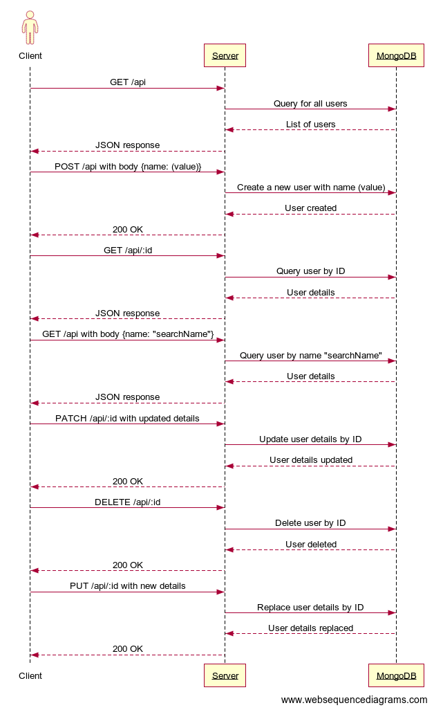

# User API
## UML DESIGN


## E.R Diagram
](E.R-Diagram.png)

### Introduction

USERCRUD is an open source REST API that is capable of CRUD operations, can also handle dynamic parameters

### Features

- Add new users into the database
- Retrieve List of users in the Database
- Search for a user by id or nmae
- Update User Details
- Delete A User by Name or ID

### Installation Guide

```
//on your local computer

git clone https://github.com/Tayoakosile/task-two

cd task-two

git checkout master

yarn install
    
```

- You can either work with the default MongoDB database or use your locally installed MongoDB. Do configure to your choice in the application entry file.
- Create an `.env` file in your project root folder and add your variables. See `.env.sample` for assistance.

### Usage

- Run `yarn start` to start the application.
- Connect to the API using Postman on port 4000 or your specified port.

### API Endpoints

| HTTP Verbs | Endpoints | Action                                  |
| ---------- | --------- | --------------------------------------- |
| POST       | /api      | To add a new user                       |
| GET        | /api      | To get list of users                    |
| GET        | /api/:id  | To retrieve details of a single user    |
| GET        | /api     | To retrieve details of a single user using params attached to request body    |
| PATCH      | /api/:id  | To edit the details of a single user    |
| DELETE     | /api/:id  | To delete a single user                 |
| PATCH      | /api/:id  | To edit the details of a single user    |
| PUT        | /api/:id  | To replace the details of a single user |

### LINKS
- TESTS API: [POSTMAN TESTS](https://www.postman.com/security-explorer-27947040/workspace/crud-api/collection/22933989-ee1271dc-d22b-4b36-92b5-a247aca8388a?tab=tests).
- Detailed Documentation: [Postman Documentation](https://documenter.getpostman.com/view/22933989/2s9YC4TXvT
)
### Technologies Used

- [NodeJS](https://nodejs.org/) This is a cross-platform runtime environment built on Chrome's V8 JavaScript engine used in running JavaScript codes on the server. It allows for installation and managing of dependencies and communication with databases.
- [FastifyJs](https://fastify.dev/) This is a NodeJS web application framework.
- [MongoDB](https://www.mongodb.com/) This is a free open source NOSQL document database with scalability and flexibility. Data are stored in flexible JSON-like documents.
- [Mongoose ODM](https://mongoosejs.com/) This makes it easy to write MongoDB validation by providing a straight-forward, schema-based solution to model to application data.

### Author

- [Tayo Akosile](https://github.com/tayoakosile)
- 

### License

This project is available for use under the MIT License.
